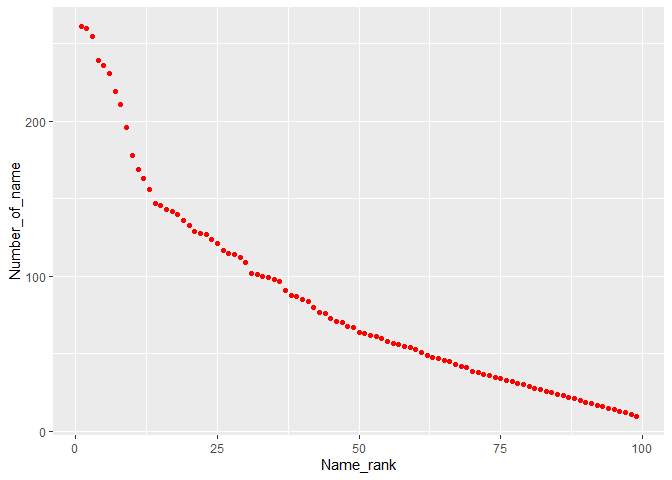

p8105\_hw2\_NL2655
================
Nankun
2019/10/4

# Library

``` r
library(tidyverse)
```

    ## -- Attaching packages ------------------------------- tidyverse 1.2.1 --

    ## √ ggplot2 3.2.1     √ purrr   0.3.2
    ## √ tibble  2.1.3     √ dplyr   0.8.3
    ## √ tidyr   1.0.0     √ stringr 1.4.0
    ## √ readr   1.3.1     √ forcats 0.4.0

    ## -- Conflicts ---------------------------------- tidyverse_conflicts() --
    ## x dplyr::filter() masks stats::filter()
    ## x dplyr::lag()    masks stats::lag()

``` r
library(readxl)
```

# Problem 1

## improting data

``` r
Trash_data = 
  read_excel ("./Data/Trash-Wheel-Collection-Totals-8-6-19.xlsx", sheet="Mr. Trash Wheel", range = cell_cols("A:N")) %>% 
  janitor::clean_names() %>% 
  drop_na(dumpster) %>% 
mutate(
  sports_balls = as.integer(sports_balls))
```

    ## Warning in FUN(X[[i]], ...): strings not representable in native encoding
    ## will be translated to UTF-8

``` r
Trash_data
```

    ## # A tibble: 344 x 14
    ##    dumpster month  year date                weight_tons volume_cubic_ya~
    ##       <dbl> <chr> <dbl> <dttm>                    <dbl>            <dbl>
    ##  1        1 May    2014 2014-05-16 00:00:00        4.31               18
    ##  2        2 May    2014 2014-05-16 00:00:00        2.74               13
    ##  3        3 May    2014 2014-05-16 00:00:00        3.45               15
    ##  4        4 May    2014 2014-05-17 00:00:00        3.1                15
    ##  5        5 May    2014 2014-05-17 00:00:00        4.06               18
    ##  6        6 May    2014 2014-05-20 00:00:00        2.71               13
    ##  7        7 May    2014 2014-05-21 00:00:00        1.91                8
    ##  8        8 May    2014 2014-05-28 00:00:00        3.7                16
    ##  9        9 June   2014 2014-06-05 00:00:00        2.52               14
    ## 10       10 June   2014 2014-06-11 00:00:00        3.76               18
    ## # ... with 334 more rows, and 8 more variables: plastic_bottles <dbl>,
    ## #   polystyrene <dbl>, cigarette_butts <dbl>, glass_bottles <dbl>,
    ## #   grocery_bags <dbl>, chip_bags <dbl>, sports_balls <int>,
    ## #   homes_powered <dbl>

``` r
Pa_2017 =
read_excel("Data/Trash-Wheel-Collection-Totals-8-6-19.xlsx",sheet = "2017 Precipitation", range = "A2:B15")%>% 
  janitor::clean_names() %>% 
  drop_na(month) %>% 
  mutate(
    year = 2017
  )
Pa_2018 =
  read_excel("Data/Trash-Wheel-Collection-Totals-8-6-19.xlsx",sheet = "2018 Precipitation", range = "A2:B15") %>% 
  janitor::clean_names() %>% 
  drop_na(month) %>% 
  mutate(
    year = 2018
  )
Pa_17_18 = 
  full_join(Pa_2017, Pa_2018, by = "month") %>% 
  mutate(month = month.name)
Pa_17_18
```

    ## # A tibble: 12 x 5
    ##    month     total.x year.x total.y year.y
    ##    <chr>       <dbl>  <dbl>   <dbl>  <dbl>
    ##  1 January      2.34   2017    0.94   2018
    ##  2 February     1.46   2017    4.8    2018
    ##  3 March        3.57   2017    2.69   2018
    ##  4 April        3.99   2017    4.69   2018
    ##  5 May          5.64   2017    9.27   2018
    ##  6 June         1.4    2017    4.77   2018
    ##  7 July         7.09   2017   10.2    2018
    ##  8 August       4.44   2017    6.45   2018
    ##  9 September    1.95   2017   10.5    2018
    ## 10 October      0      2017    2.12   2018
    ## 11 November     0.11   2017    7.82   2018
    ## 12 December     0.94   2017    6.11   2018

# problem 2

## clean pols\_month

``` r
pols_month = 
  read_csv("Data/fivethirtyeight_datasets/pols-month.csv") %>% 
  janitor::clean_names() %>% 
  separate(mon, c("year", "month", "day"))%>% 
  mutate(
    month = as.numeric(month),
    month = month.name[month],
  ) %>% 
  pivot_longer(c(prez_gop,prez_dem),
    names_to = "president",
    names_prefix = "prez_"
  ) %>% 
  select(-day)
```

    ## Parsed with column specification:
    ## cols(
    ##   mon = col_date(format = ""),
    ##   prez_gop = col_double(),
    ##   gov_gop = col_double(),
    ##   sen_gop = col_double(),
    ##   rep_gop = col_double(),
    ##   prez_dem = col_double(),
    ##   gov_dem = col_double(),
    ##   sen_dem = col_double(),
    ##   rep_dem = col_double()
    ## )

``` r
pols_month
```

    ## # A tibble: 1,644 x 10
    ##    year  month gov_gop sen_gop rep_gop gov_dem sen_dem rep_dem president
    ##    <chr> <chr>   <dbl>   <dbl>   <dbl>   <dbl>   <dbl>   <dbl> <chr>    
    ##  1 1947  Janu~      23      51     253      23      45     198 gop      
    ##  2 1947  Janu~      23      51     253      23      45     198 dem      
    ##  3 1947  Febr~      23      51     253      23      45     198 gop      
    ##  4 1947  Febr~      23      51     253      23      45     198 dem      
    ##  5 1947  March      23      51     253      23      45     198 gop      
    ##  6 1947  March      23      51     253      23      45     198 dem      
    ##  7 1947  April      23      51     253      23      45     198 gop      
    ##  8 1947  April      23      51     253      23      45     198 dem      
    ##  9 1947  May        23      51     253      23      45     198 gop      
    ## 10 1947  May        23      51     253      23      45     198 dem      
    ## # ... with 1,634 more rows, and 1 more variable: value <dbl>

## clean snp

``` r
snp =
  read_csv("Data/fivethirtyeight_datasets/snp.csv") %>% 
janitor::clean_names() %>% 
  separate(date, c("month", "day", "year"))%>% 
  select(-day) %>% 
  arrange(year, as.integer(month)) %>% 
    mutate(
    month = as.numeric(month),
    month = month.name[month],
  )
```

    ## Parsed with column specification:
    ## cols(
    ##   date = col_character(),
    ##   close = col_double()
    ## )

``` r
snp
```

    ## # A tibble: 787 x 3
    ##    month     year  close
    ##    <chr>     <chr> <dbl>
    ##  1 January   1950   17.0
    ##  2 February  1950   17.2
    ##  3 March     1950   17.3
    ##  4 April     1950   18.0
    ##  5 May       1950   18.8
    ##  6 June      1950   17.7
    ##  7 July      1950   17.8
    ##  8 August    1950   18.4
    ##  9 September 1950   19.5
    ## 10 October   1950   19.5
    ## # ... with 777 more rows

## clean unemployment

``` r
unemployment = 
  read_csv("Data/fivethirtyeight_datasets/unemployment.csv") %>% 
  janitor::clean_names() %>% 
  pivot_longer(jan:dec,
    names_to = "month"
  ) %>% 
  mutate( 
    year = as.character(year),
    month = recode(month,
    "jan" = "January",
    "feb" = "February",
    "mar" = "March",
    "apr" = "April",
    "may" = "May",
    "jun" = "June",
    "jul" = "July",
    "aug" = "August",
    "sep" = "September",
    "oct" = "October",
    "nov" = "November",
    "dec" = "December"
  ))
```

    ## Parsed with column specification:
    ## cols(
    ##   Year = col_double(),
    ##   Jan = col_double(),
    ##   Feb = col_double(),
    ##   Mar = col_double(),
    ##   Apr = col_double(),
    ##   May = col_double(),
    ##   Jun = col_double(),
    ##   Jul = col_double(),
    ##   Aug = col_double(),
    ##   Sep = col_double(),
    ##   Oct = col_double(),
    ##   Nov = col_double(),
    ##   Dec = col_double()
    ## )

``` r
unemployment
```

    ## # A tibble: 816 x 3
    ##    year  month     value
    ##    <chr> <chr>     <dbl>
    ##  1 1948  January     3.4
    ##  2 1948  February    3.8
    ##  3 1948  March       4  
    ##  4 1948  April       3.9
    ##  5 1948  May         3.5
    ##  6 1948  June        3.6
    ##  7 1948  July        3.6
    ##  8 1948  August      3.9
    ##  9 1948  September   3.8
    ## 10 1948  October     3.7
    ## # ... with 806 more rows

## merge

``` r
snp_pol = 
  full_join(pols_month, snp, by =c("year", "month"))

Summary_data = 
  full_join(snp_pol, unemployment, by =c("year", "month"))
Summary_data
```

    ## # A tibble: 1,650 x 12
    ##    year  month gov_gop sen_gop rep_gop gov_dem sen_dem rep_dem president
    ##    <chr> <chr>   <dbl>   <dbl>   <dbl>   <dbl>   <dbl>   <dbl> <chr>    
    ##  1 1947  Janu~      23      51     253      23      45     198 gop      
    ##  2 1947  Janu~      23      51     253      23      45     198 dem      
    ##  3 1947  Febr~      23      51     253      23      45     198 gop      
    ##  4 1947  Febr~      23      51     253      23      45     198 dem      
    ##  5 1947  March      23      51     253      23      45     198 gop      
    ##  6 1947  March      23      51     253      23      45     198 dem      
    ##  7 1947  April      23      51     253      23      45     198 gop      
    ##  8 1947  April      23      51     253      23      45     198 dem      
    ##  9 1947  May        23      51     253      23      45     198 gop      
    ## 10 1947  May        23      51     253      23      45     198 dem      
    ## # ... with 1,640 more rows, and 3 more variables: value.x <dbl>,
    ## #   close <dbl>, value.y <dbl>

# Problem 3

## data cleaning

``` r
Popular_Baby = read_csv("Data/Popular_Baby_Names.csv") %>% 
  janitor::clean_names() %>% 
  mutate_all(toupper) %>% 
  mutate(
    ethnicity = replace(ethnicity, ethnicity == "ASIAN AND PACI", "ASIAN AND PACIFIC ISLANDER"),
    ethnicity = replace(ethnicity, ethnicity == "BLACK NON HISP", "BLACK NON HISPANIC"),
    ethnicity = replace(ethnicity, ethnicity == "WHITE NON HISP", "WHITE NON HISPANIC")
  ) %>% 
  distinct()
```

    ## Parsed with column specification:
    ## cols(
    ##   `Year of Birth` = col_double(),
    ##   Gender = col_character(),
    ##   Ethnicity = col_character(),
    ##   `Child's First Name` = col_character(),
    ##   Count = col_double(),
    ##   Rank = col_double()
    ## )

``` r
Popular_Baby %>% 
  count(ethnicity)
```

    ## # A tibble: 4 x 2
    ##   ethnicity                      n
    ##   <chr>                      <int>
    ## 1 ASIAN AND PACIFIC ISLANDER  2140
    ## 2 BLACK NON HISPANIC          2186
    ## 3 HISPANIC                    3564
    ## 4 WHITE NON HISPANIC          4291

``` r
Popular_Baby
```

    ## # A tibble: 12,181 x 6
    ##    year_of_birth gender ethnicity              childs_first_na~ count rank 
    ##    <chr>         <chr>  <chr>                  <chr>            <chr> <chr>
    ##  1 2016          FEMALE ASIAN AND PACIFIC ISL~ OLIVIA           172   1    
    ##  2 2016          FEMALE ASIAN AND PACIFIC ISL~ CHLOE            112   2    
    ##  3 2016          FEMALE ASIAN AND PACIFIC ISL~ SOPHIA           104   3    
    ##  4 2016          FEMALE ASIAN AND PACIFIC ISL~ EMILY            99    4    
    ##  5 2016          FEMALE ASIAN AND PACIFIC ISL~ EMMA             99    4    
    ##  6 2016          FEMALE ASIAN AND PACIFIC ISL~ MIA              79    5    
    ##  7 2016          FEMALE ASIAN AND PACIFIC ISL~ CHARLOTTE        59    6    
    ##  8 2016          FEMALE ASIAN AND PACIFIC ISL~ SARAH            57    7    
    ##  9 2016          FEMALE ASIAN AND PACIFIC ISL~ ISABELLA         56    8    
    ## 10 2016          FEMALE ASIAN AND PACIFIC ISL~ HANNAH           56    8    
    ## # ... with 12,171 more rows

## Table 1 “Olivia”

``` r
Olivia_df = 
Popular_Baby %>% 
  filter(gender == "FEMALE", childs_first_name == "OLIVIA") %>% 
  select(year_of_birth, ethnicity, rank) %>% 
  arrange(year_of_birth) %>% 
  pivot_wider(
    names_from = "year_of_birth",
    values_from = "rank"
  ) %>% 
  knitr::kable()
Olivia_df
```

| ethnicity                  | 2011 | 2012 | 2013 | 2014 | 2015 | 2016 |
| :------------------------- | :--- | :--- | :--- | :--- | :--- | :--- |
| ASIAN AND PACIFIC ISLANDER | 4    | 3    | 3    | 1    | 1    | 1    |
| BLACK NON HISPANIC         | 10   | 8    | 6    | 8    | 4    | 8    |
| HISPANIC                   | 18   | 22   | 22   | 16   | 16   | 13   |
| WHITE NON HISPANIC         | 2    | 4    | 1    | 1    | 1    | 1    |

## Table 2 Most popular boies’ names

``` r
boy_df =
  Popular_Baby %>% 
  filter(gender == "MALE", rank == "1") %>% 
  select(year_of_birth, childs_first_name, ethnicity) %>% 
  arrange(year_of_birth) %>% 
  pivot_wider(
    names_from = "year_of_birth",
    values_from = "childs_first_name"
  ) %>% 
  knitr::kable()
boy_df
```

| ethnicity                  | 2011    | 2012   | 2013   | 2014   | 2015   | 2016   |
| :------------------------- | :------ | :----- | :----- | :----- | :----- | :----- |
| ASIAN AND PACIFIC ISLANDER | ETHAN   | RYAN   | JAYDEN | JAYDEN | JAYDEN | ETHAN  |
| BLACK NON HISPANIC         | JAYDEN  | JAYDEN | ETHAN  | ETHAN  | NOAH   | NOAH   |
| HISPANIC                   | JAYDEN  | JAYDEN | JAYDEN | LIAM   | LIAM   | LIAM   |
| WHITE NON HISPANIC         | MICHAEL | JOSEPH | DAVID  | JOSEPH | DAVID  | JOSEPH |

## Scatter plot

``` r
white_boy =
  Popular_Baby %>% 
  filter(gender == "MALE", ethnicity == "WHITE NON HISPANIC", year_of_birth == "2016") %>% 
  mutate(
    rank = as.numeric(rank),
    count = as.numeric(count)
  ) %>% 
  ggplot(aes(x = rank, y = count))+
  geom_point(color = "red")
white_boy
```

<!-- -->
